# Bookz App - Exhaustive Products Architecture & Operations Map

This diagram is a comprehensive, highly technical map of **ALL user operations** within the Products feature. It strictly adheres to all our established architectural rules:

1. **Vertical 3-Tier Stack** (UI -> GetX -> Hive).
2. **UI Layer:** Specific Widgets, Purposes, and Action triggers.
3. **GetX Layer:** Subgraphs for files, detailing Dart method signatures and Purposes.
4. **Hive Layer:** Subgraphs for physical files, detailing precise Dart database method signatures and Purposes.
5. **Strict Boundaries & Funneling:** Data flows securely from Views, funnels through the Controllers, and hits the specific Database methods.

```mermaid
graph TD
    %% ==========================================
    %% TOP LAYER: USER INTERFACE (VIEWS)
    %% ==========================================
    subgraph UI_Layer ["📱 User Interface (Views)"]
        direction LR
        UI_List["<b>Product List Screen</b><br/>Elements: InitState, SearchBar, Scroll, Tabs<br/>Purpose: View & filter inventory"]
        UI_Add["<b>Add/Edit Product Screen</b><br/>Elements: InitState, Buttons, Icons<br/>Purpose: Create or edit product details"]
        UI_Cat["<b>Category Screen</b><br/>Elements: InitState, SaveBtn, DeleteIcon<br/>Purpose: Manage categories"]
        UI_Brand["<b>Brand Screen</b><br/>Elements: InitState, SaveBtn, DeleteIcon<br/>Purpose: Manage brands"]
        UI_Det["<b>Product Details Screen</b><br/>Elements: InitState, UI Builders<br/>Purpose: View deep product details & taxes"]
    end

    %% ==========================================
    %% MIDDLE LAYER: BUSINESS LOGIC (GETX)
    %% ==========================================
    subgraph GetX_Layer ["🧠 Business Logic (GetX Controllers)"]
        direction LR
        
        subgraph Ctrl_List ["products_list_controller.dart"]
            direction TB
            GL_Get["Future&lt;void&gt; getProductList()<br/>Purpose: Fetch product list"]
            GL_Filt["void filterProductss(String query)<br/>Purpose: Search products"]
            GL_More["void loadMoreProducts()<br/>Purpose: Paginate products"]
            GL_UpdF["void updateFilter(ProductFilter filter)<br/>Purpose: Switch tabs"]
        end
        
        subgraph Ctrl_Add ["products_add_controller.dart"]
            direction TB
            GA_Init["void onInit() / Future&lt;void&gt; initSku()<br/>Purpose: Setup state & SKU"]
            GA_Sel["void brandSelect() / void categorySelect()<br/>Purpose: Open selection dialogs"]
            GA_Bar["void generateBarCode()<br/>Purpose: Create barcode string"]
            GA_Save["Future&lt;void&gt; saveProduct(BuildContext context)<br/>Purpose: Insert new product"]
            GA_Upd["Future&lt;void&gt; updateProduct(BuildContext context)<br/>Purpose: Modify product"]
        end
        
        subgraph Ctrl_Cat ["product_categories_controller.dart"]
            direction TB
            GC_Get["Future&lt;void&gt; getProductCategory()<br/>Purpose: Load categories"]
            GC_Save["Future&lt;void&gt; saveCategory()<br/>Purpose: Insert category"]
            GC_Edit["Future&lt;void&gt; editCategory()<br/>Purpose: Modify category"]
            GC_Del["Future&lt;void&gt; deleteCategory(String catId)<br/>Purpose: Remove category"]
        end

        subgraph Ctrl_Brand ["product_brand_controller.dart"]
            direction TB
            GB_Get["Future&lt;void&gt; getProductBrand()<br/>Purpose: Load brands"]
            GB_Save["Future&lt;void&gt; saveBrand()<br/>Purpose: Insert brand"]
            GB_Edit["Future&lt;void&gt; editBrand()<br/>Purpose: Modify brand"]
            GB_Del["Future&lt;void&gt; deleteBrand(String brandId)<br/>Purpose: Remove brand"]
        end
        
        subgraph Ctrl_Det ["product_details_controller.dart"]
            direction TB
            GD_Fetch["Future&lt;void&gt; fetchProductDetails(String productID)<br/>Purpose: Load full details"]
            GD_Tax["Future&lt;String&gt; calculateTax(double price, String taxId)<br/>Purpose: Compute dynamic pricing"]
        end
    end

    %% ==========================================
    %% BOTTOM LAYER: DATA ACCESS (HIVE FILES)
    %% ==========================================
    subgraph Hive_Layer ["💾 Data Access Layer (Hive Operations)"]
        direction LR
        
        subgraph DB_Prod ["hive_product.dart (HiveProductController)"]
            direction TB
            HP_GetP["Future&lt;List&lt;Product&gt;&gt; getLocalProductList()<br/>Purpose: Read products from DB"]
            HP_SavP["Future&lt;void&gt; saveProduct(Product product)<br/>Purpose: Write/Update product in DB"]
            
            HP_GetC["Future&lt;List&lt;ProductCategory&gt;&gt; getLocalProductCategories()<br/>Purpose: Read categories from DB"]
            HP_SavC["Future&lt;void&gt; saveProductCategory(ProductCategory category)<br/>Purpose: Write/Update category in DB"]
            HP_DelC["Future&lt;void&gt; deleteProductCategory(String id)<br/>Purpose: Remove category from DB"]
            
            HP_GetB["Future&lt;List&lt;ProductBrand&gt;&gt; getLocalProductBrands()<br/>Purpose: Read brands from DB"]
            HP_SavB["Future&lt;void&gt; saveProductBrand(ProductBrand brand)<br/>Purpose: Write/Update brand in DB"]
            HP_DelB["Future&lt;void&gt; deleteProductBrand(String id)<br/>Purpose: Remove brand from DB"]
        end
        
        subgraph DB_Serial ["hive_product_serial.dart (HiveProductSerialController)"]
            direction TB
            HS_Get["Future&lt;List&lt;ProductSerial&gt;&gt; getProductSerials(String productId)<br/>Purpose: Read product serials from DB"]
            HS_Sav["Future&lt;void&gt; saveProductSerials(List&lt;ProductSerial&gt; serials)<br/>Purpose: Write product serials to DB"]
        end
    end

    %% ==========================================
    %% ⬇️ DOWNWARD FLOW: UI -> GETX
    %% ==========================================
    UI_List -->|Load/Scroll| GL_Get & GL_More
    UI_List -->|Search/Filter| GL_Filt & GL_UpdF
    
    UI_Add -->|Init/Helpers| GA_Init & GA_Sel & GA_Bar
    UI_Add -->|Save/Update| GA_Save & GA_Upd
    
    UI_Cat -->|Load| GC_Get
    UI_Cat -->|Save/Edit| GC_Save & GC_Edit
    UI_Cat -->|Delete| GC_Del
    
    UI_Brand -->|Load| GB_Get
    UI_Brand -->|Save/Edit| GB_Save & GB_Edit
    UI_Brand -->|Delete| GB_Del
    
    UI_Det -->|Load Details| GD_Fetch
    UI_Det -->|View Tax| GD_Tax

    %% ==========================================
    %% ⬇️ DOWNWARD FLOW: GETX -> HIVE
    %% ==========================================
    GL_Get & GL_More ==>|Reads Products| HP_GetP
    
    GA_Save & GA_Upd ==>|Writes Core Data| HP_SavP
    GA_Save & GA_Upd ==>|Writes Serial Data| HS_Sav
    
    GC_Get ==>|Reads Categories| HP_GetC
    GC_Save & GC_Edit ==>|Writes Category| HP_SavC
    GC_Del ==>|Deletes Category| HP_DelC
    
    GB_Get ==>|Reads Brands| HP_GetB
    GB_Save & GB_Edit ==>|Writes Brand| HP_SavB
    GB_Del ==>|Deletes Brand| HP_DelB
    
    GD_Fetch ==>|Reads Core Data| HP_GetP
    GD_Fetch ==>|Reads Serial Data| HS_Get

    %% Styling
    classDef layerBox fill:none,stroke:#ffffff,stroke-width:2px,stroke-dasharray: 5 5,color:#ffffff;
    classDef ui fill:#1565c0,stroke:#0d47a1,stroke-width:2px,color:#ffffff;
    classDef logic fill:#2e7d32,stroke:#1b5e20,stroke-width:2px,color:#ffffff;
    classDef data fill:#e65100,stroke:#bf360c,stroke-width:2px,color:#ffffff;
    
    class UI_Layer,GetX_Layer,Hive_Layer layerBox;
    class UI_List,UI_Add,UI_Cat,UI_Brand,UI_Det ui;
    class GL_Get,GL_Filt,GL_More,GL_UpdF,GA_Init,GA_Sel,GA_Bar,GA_Save,GA_Upd,GC_Get,GC_Save,GC_Edit,GC_Del,GB_Get,GB_Save,GB_Edit,GB_Del,GD_Fetch,GD_Tax logic;
    class HP_GetP,HP_SavP,HP_GetC,HP_SavC,HP_DelC,HP_GetB,HP_SavB,HP_DelB,HS_Get,HS_Sav data;
```

