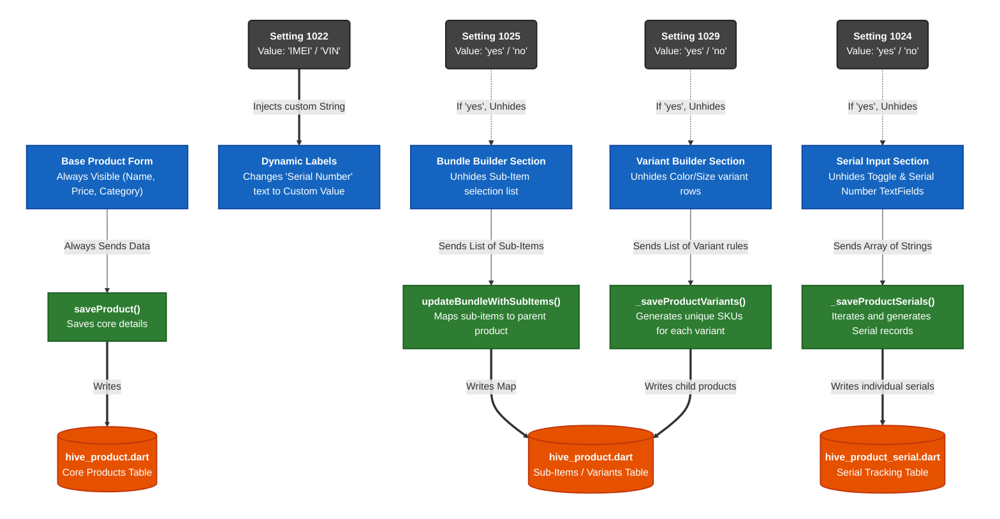

# How Business Settings Deeply Affect Product Features

In the Bookz App, the **Business Settings** module acts as the "Master Configuration Switchboard." It doesn't just change colors or themes; it structurally alters how the core inventory system works by turning advanced features on or off.

When the user opens the `Add Product Screen` or the `Product Details Screen`, the UI directly reads from the `business_settings` Hive database. Depending on the values it finds, it fundamentally changes the UI layout, the data collected, and the database tables that get written to.

### The 4 Core Settings

Here is exactly what the code is checking for under the hood:

1.  **Setting 1022: Custom Serial Labels (`serialName`)**
    *   **What it does:** Allows the business to rename "Serial Number" to something relevant to their industry (e.g., "IMEI Number" for mobile shops, "VIN" for mechanics, "Batch No" for pharmacies).
    *   **Impact:** Dynamically replaces the text on dozens of labels, buttons, dialogs, and text fields across both the Add and Details screens.
2.  **Setting 1024: Serial Tracking (`isSerialSettingEnabled`)**
    *   **What it does:** Enables the inventory system to track items individually rather than just by bulk quantity.
    *   **Impact:** Unhides the "Inventory Tracking by [SerialName]" toggle. If turned on by the user, the app renders dynamic text fields to collect exact serial numbers. When saved, the Controller splits the save operation to write to `hive_product_serial.dart` in addition to `hive_product.dart`.
3.  **Setting 1025: Bundle Products (`isBundleSettingEnabled`)**
    *   **What it does:** Enables the creation of Composite Products (selling a "Gift Basket" made of 3 existing separate products).
    *   **Impact:** Unhides the "Bundle/Composite" UI section. When saved, the controller writes relational mapping data tying the master product to its sub-items in the database.
4.  **Setting 1029: Product Variants (`isVariantSettingEnabled`)**
    *   **What it does:** Enables the creation of item variations (e.g., selling a T-Shirt in Red, Blue, Small, Large).
    *   **Impact:** Unhides the "Variants" UI section. This fundamentally changes the save logic, forcing the controller to generate multiple unique SKUs and write multiple variant rows into the database linked to the parent product.

---

### The Architecture Diagram of the Impact

This diagram maps exactly how these 4 configuration flags cascade down from the Global Settings Database, into the UI structure, and ultimately dictate the Business Logic execution path.

