# Bookz App - Products Feature Level 2 System Context

This diagram is an exhaustive extension of our initial architecture mapping. It merges the complete, highly detailed method signatures from the Level 1 internal diagram with the **6-Box Level 2 Structure**. 

It encapsulates the fully detailed internal 3-tier feature core (Boxes 1, 2, and 3) while accurately mapping the critical external domain boundaries:
*   **Box 4 (External Mutators):** Who bypasses the feature's logic to change its data.
*   **Box 5 (External Readers):** Who passively consumes the feature's data.
*   **Box 6 (Configuration Dependencies):** Global settings that change the feature's internal rules.

```mermaid
graph TD
    %% ==========================================
    %% LEVEL 2 SYSTEM CONTEXT BOUNDARIES
    %% ==========================================

    %% ------------------------------------------
    %% BOX 6: CONFIGURATION DEPENDENCIES
    %% ------------------------------------------
    subgraph Box6_Config ["⚙️ Box 6: Configuration Dependencies"]
        direction LR
        CFG_Biz["<b>Business Settings (Hive)</b><br/>Enables Serials, Bundles, Variants<br/>Renames Serial labels"]
        CFG_Pref["<b>Shared Preferences</b><br/>Provides business_id, userid<br/>Provides hasGst, gstType"]
        CFG_Perm["<b>Permission Helper</b><br/>Checks 'canUpdateProduct' access"]
    end

    %% ------------------------------------------
    %% INTERNAL CORE (BOXES 1, 2, 3)
    %% ------------------------------------------
    subgraph Internal_Core ["📦 Internal Products Feature Core"]
        direction TB

        %% BOX 1: UI LAYER
        subgraph UI_Layer ["📱 Box 1: UI Layer (Views)"]
            direction LR
            UI_List["<b>Product List Screen</b><br/>Elements: InitState, SearchBar, Scroll, Tabs<br/>Purpose: View & filter inventory"]
            UI_Add["<b>Add/Edit Product Screen</b><br/>Elements: InitState, Buttons, Icons<br/>Purpose: Create or edit product details"]
            UI_Cat["<b>Category Screen</b><br/>Elements: InitState, SaveBtn, DeleteIcon<br/>Purpose: Manage categories"]
            UI_Brand["<b>Brand Screen</b><br/>Elements: InitState, SaveBtn, DeleteIcon<br/>Purpose: Manage brands"]
            UI_Det["<b>Product Details Screen</b><br/>Elements: InitState, UI Builders<br/>Purpose: View deep product details & taxes"]
        end

        %% BOX 2: GETX LAYER
        subgraph GetX_Layer ["🧠 Box 2: GetX Layer (Business Logic)"]
            direction LR
            
            subgraph Ctrl_List ["products_list_controller.dart"]
                direction TB
                GL_Get["Future&lt;void&gt; getProductList()<br/>Purpose: Fetch product list"]
                GL_Filt["void filterProductss(String query)<br/>Purpose: Search products"]
                GL_More["void loadMoreProducts()<br/>Purpose: Paginate products"]
                GL_UpdF["void updateFilter(ProductFilter filter)<br/>Purpose: Switch tabs"]
            end
            
            subgraph Ctrl_Add ["products_add_controller.dart"]
                direction TB
                GA_Init["void onInit() / Future&lt;void&gt; initSku()<br/>Purpose: Setup state & SKU"]
                GA_Sel["void brandSelect() / void categorySelect()<br/>Purpose: Open selection dialogs"]
                GA_Bar["void generateBarCode()<br/>Purpose: Create barcode string"]
                GA_Save["Future&lt;void&gt; saveProduct(BuildContext context)<br/>Purpose: Insert new product"]
                GA_Upd["Future&lt;void&gt; updateProduct(BuildContext context)<br/>Purpose: Modify product"]
            end
            
            subgraph Ctrl_Cat ["product_categories_controller.dart"]
                direction TB
                GC_Get["Future&lt;void&gt; getProductCategory()<br/>Purpose: Load categories"]
                GC_Save["Future&lt;void&gt; saveCategory()<br/>Purpose: Insert category"]
                GC_Edit["Future&lt;void&gt; editCategory()<br/>Purpose: Modify category"]
                GC_Del["Future&lt;void&gt; deleteCategory(String catId)<br/>Purpose: Remove category"]
            end

            subgraph Ctrl_Brand ["product_brand_controller.dart"]
                direction TB
                GB_Get["Future&lt;void&gt; getProductBrand()<br/>Purpose: Load brands"]
                GB_Save["Future&lt;void&gt; saveBrand()<br/>Purpose: Insert brand"]
                GB_Edit["Future&lt;void&gt; editBrand()<br/>Purpose: Modify brand"]
                GB_Del["Future&lt;void&gt; deleteBrand(String brandId)<br/>Purpose: Remove brand"]
            end
            
            subgraph Ctrl_Det ["product_details_controller.dart"]
                direction TB
                GD_Fetch["Future&lt;void&gt; fetchProductDetails(String productID)<br/>Purpose: Load full details"]
                GD_Tax["Future&lt;String&gt; calculateTax(double price, String taxId)<br/>Purpose: Compute dynamic pricing"]
            end
        end

        %% BOX 3: HIVE LAYER
        subgraph Hive_Layer ["💾 Box 3: Hive Layer (Data Access)"]
            direction LR
            
            subgraph DB_Prod ["hive_product.dart (HiveProductController)"]
                direction TB
                HP_GetP["Future&lt;List&lt;Product&gt;&gt; getLocalProductList()<br/>Purpose: Read products from DB"]
                HP_SavP["Future&lt;void&gt; saveProduct(Product product)<br/>Purpose: Write/Update product in DB"]
                
                HP_GetC["Future&lt;List&lt;ProductCategory&gt;&gt; getLocalProductCategories()<br/>Purpose: Read categories from DB"]
                HP_SavC["Future&lt;void&gt; saveProductCategory(ProductCategory category)<br/>Purpose: Write/Update category in DB"]
                HP_DelC["Future&lt;void&gt; deleteProductCategory(String id)<br/>Purpose: Remove category from DB"]
                
                HP_GetB["Future&lt;List&lt;ProductBrand&gt;&gt; getLocalProductBrands()<br/>Purpose: Read brands from DB"]
                HP_SavB["Future&lt;void&gt; saveProductBrand(ProductBrand brand)<br/>Purpose: Write/Update brand in DB"]
                HP_DelB["Future&lt;void&gt; deleteProductBrand(String id)<br/>Purpose: Remove brand from DB"]
            end
            
            subgraph DB_Serial ["hive_product_serial.dart (HiveProductSerialController)"]
                direction TB
                HS_Get["Future&lt;List&lt;ProductSerial&gt;&gt; getProductSerials(String productId)<br/>Purpose: Read product serials from DB"]
                HS_Sav["Future&lt;void&gt; saveProductSerials(List&lt;ProductSerial&gt; serials)<br/>Purpose: Write product serials to DB"]
            end
        end

        %% Internal Flow Connections
        UI_List -->|Load/Scroll| GL_Get & GL_More
        UI_List -->|Search/Filter| GL_Filt & GL_UpdF
        
        UI_Add -->|Init/Helpers| GA_Init & GA_Sel & GA_Bar
        UI_Add -->|Save/Update| GA_Save & GA_Upd
        
        UI_Cat -->|Load| GC_Get
        UI_Cat -->|Save/Edit| GC_Save & GC_Edit
        UI_Cat -->|Delete| GC_Del
        
        UI_Brand -->|Load| GB_Get
        UI_Brand -->|Save/Edit| GB_Save & GB_Edit
        UI_Brand -->|Delete| GB_Del
        
        UI_Det -->|Load Details| GD_Fetch
        UI_Det -->|View Tax| GD_Tax

        GL_Get & GL_More ==>|Reads Products| HP_GetP
        
        GA_Save & GA_Upd ==>|Writes Core Data| HP_SavP
        GA_Save & GA_Upd ==>|Writes Serial Data| HS_Sav
        
        GC_Get ==>|Reads Categories| HP_GetC
        GC_Save & GC_Edit ==>|Writes Category| HP_SavC
        GC_Del ==>|Deletes Category| HP_DelC
        
        GB_Get ==>|Reads Brands| HP_GetB
        GB_Save & GB_Edit ==>|Writes Brand| HP_SavB
        GB_Del ==>|Deletes Brand| HP_DelB
        
        GD_Fetch ==>|Reads Core Data| HP_GetP
        GD_Fetch ==>|Reads Serial Data| HS_Get
    end

    %% ------------------------------------------
    %% BOX 4: EXTERNAL MUTATORS
    %% ------------------------------------------
    subgraph Box4_Mutators ["📥 Box 4: External Mutators (Writers)"]
        direction TB
        EXT_M_Sales["<b>Sales Module</b><br/>Assigns/Updates Product Serials"]
        EXT_M_Purch["<b>Purchases Module</b><br/>Registers new Product Serials"]
        EXT_M_Ret["<b>Sales/Purchase Returns</b><br/>Frees up or deletes Serials"]
        EXT_M_Exp["<b>Expenses Module</b><br/>Directly creates/edits Products"]
    end

    %% ------------------------------------------
    %% BOX 5: EXTERNAL READERS
    %% ------------------------------------------
    subgraph Box5_Readers ["📤 Box 5: External Readers (Consumers)"]
        direction TB
        EXT_R_Sales["<b>Sales & Purchases</b><br/>Selects items, reads price/tax"]
        EXT_R_Est["<b>Estimates & POs</b><br/>Reads data for PDF quotations"]
        EXT_R_Rep["<b>Reports & Dashboard</b><br/>Reads stock levels & movement"]
    end

    %% ==========================================
    %% EXTERNAL RELATIONSHIPS
    %% ==========================================
    
    %% Configs -> Core (Box 6 -> Box 1/2)
    CFG_Biz -.->|Dictates logic & UI fields| GA_Init
    CFG_Pref -.->|Dictates Tax logic| GD_Tax
    CFG_Perm -.->|Hides Edit button| UI_Det

    %% Mutators -> Hive (Box 4 -> Box 3)
    EXT_M_Sales ==>|Directly Updates Serials| HS_Sav
    EXT_M_Purch ==>|Directly Writes Serials| HS_Sav
    EXT_M_Ret ==>|Directly Modifies Serials| HS_Sav
    EXT_M_Exp ==>|Directly Writes Product| HP_SavP

    %% Hive -> Readers (Box 3 -> Box 5)
    HP_GetP ==>|Provides Core Data| EXT_R_Sales
    HP_GetP ==>|Provides Core Data| EXT_R_Est
    HP_GetP ==>|Provides Stock Analytics| EXT_R_Rep

    %% ==========================================
    %% STYLING
    %% ==========================================
    classDef layerBox fill:none,stroke:#ffffff,stroke-width:2px,stroke-dasharray: 5 5,color:#ffffff;
    classDef ui fill:#1565c0,stroke:#0d47a1,stroke-width:2px,color:#ffffff;
    classDef logic fill:#2e7d32,stroke:#1b5e20,stroke-width:2px,color:#ffffff;
    classDef data fill:#e65100,stroke:#bf360c,stroke-width:2px,color:#ffffff;
    classDef extMutator fill:#6a1b9a,stroke:#4a148c,stroke-width:2px,color:#ffffff;
    classDef extReader fill:#00695c,stroke:#004d40,stroke-width:2px,color:#ffffff;
    classDef config fill:#424242,stroke:#212121,stroke-width:2px,color:#ffffff;
    
    class Internal_Core,UI_Layer,GetX_Layer,Hive_Layer,Box4_Mutators,Box5_Readers,Box6_Config layerBox;
    class UI_List,UI_Add,UI_Cat,UI_Brand,UI_Det ui;
    class GL_Get,GL_Filt,GL_More,GL_UpdF,GA_Init,GA_Sel,GA_Bar,GA_Save,GA_Upd,GC_Get,GC_Save,GC_Edit,GC_Del,GB_Get,GB_Save,GB_Edit,GB_Del,GD_Fetch,GD_Tax logic;
    class HP_GetP,HP_SavP,HP_GetC,HP_SavC,HP_DelC,HP_GetB,HP_SavB,HP_DelB,HS_Get,HS_Sav data;
    class EXT_M_Sales,EXT_M_Purch,EXT_M_Ret,EXT_M_Exp extMutator;
    class EXT_R_Sales,EXT_R_Est,EXT_R_Rep extReader;
    class CFG_Biz,CFG_Pref,CFG_Perm config;
```

