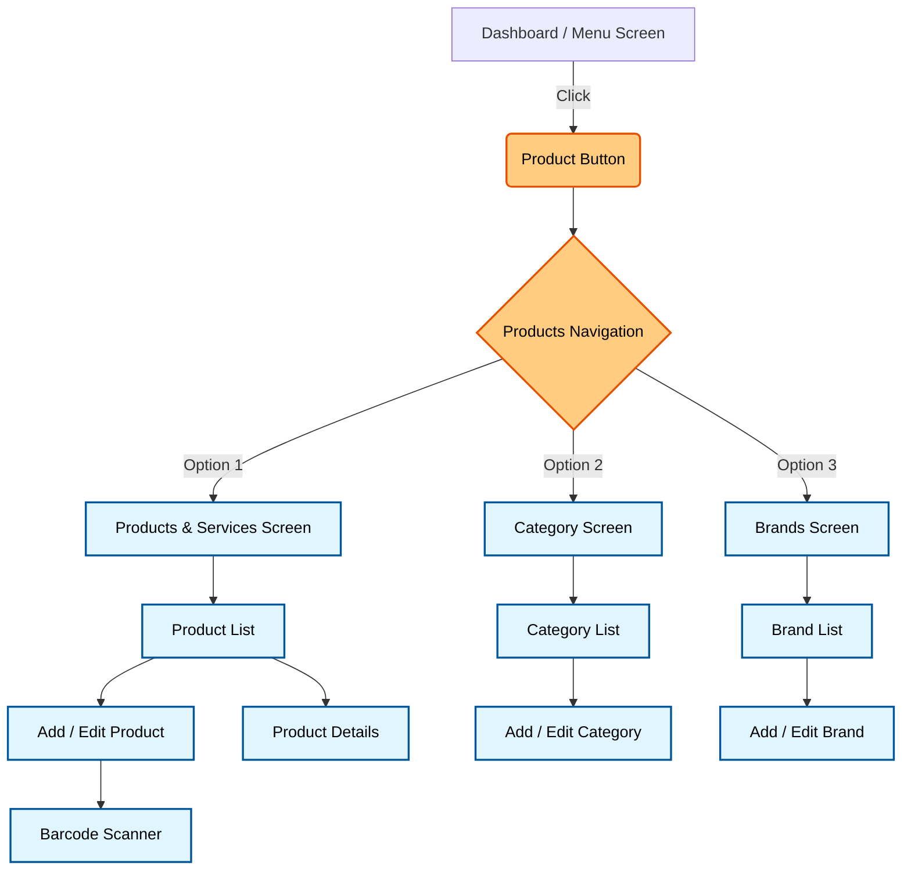

# Bookz App - Products Screen Flow Diagram

This diagram illustrates the screen-by-screen user navigation flow for the Products feature based on your description.

```mermaid
graph TD
    %% Main Entry
    A[Dashboard / Menu Screen] -->|Click| B(Product Button)
    
    %% Product Menu / Sections
    B --> C{Products Navigation}
    
    %% The Three Main Product Sections
    C -->|Option 1| D[Products & Services Screen]
    C -->|Option 2| E[Category Screen]
    C -->|Option 3| F[Brands Screen]
    
    %% Products & Services Flow
    D --> P1[Product List]
    P1 --> P2[Add / Edit Product]
    P1 --> P3[Product Details]
    P2 --> P4[Barcode Scanner]
    
    %% Category Flow
    E --> C1[Category List]
    C1 --> C2[Add / Edit Category]
    
    %% Brands Flow
    F --> B1[Brand List]
    B1 --> B2[Add / Edit Brand]

    %% Styling
    classDef button fill:#ffcc80,stroke:#e65100,stroke-width:2px,color:#000;
    classDef screen fill:#e1f5fe,stroke:#01579b,stroke-width:2px,color:#000;
    class B,C button;
    class D,E,F,P1,P2,P3,P4,C1,C2,B1,B2 screen;
```
